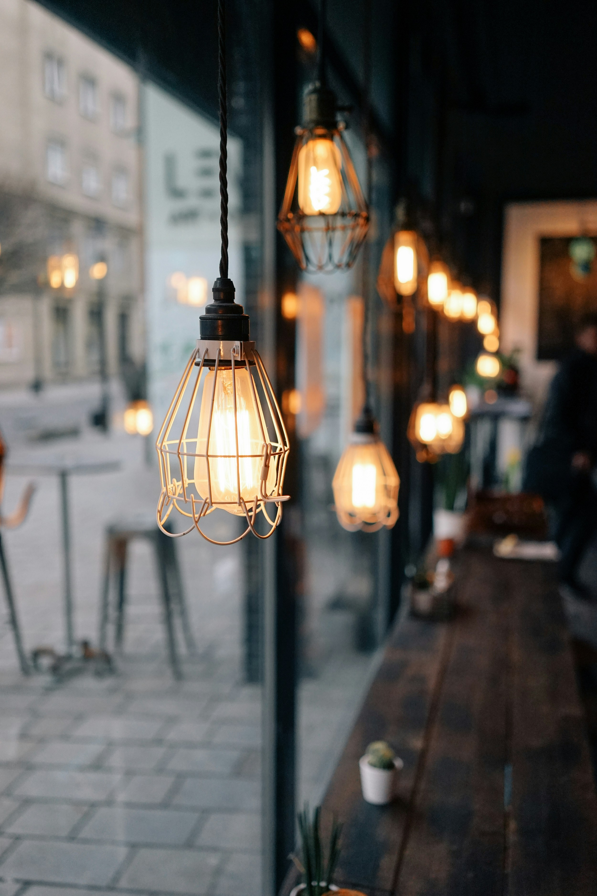

# Lamp Cafe（ポートフォリオ作品）

## ■ 概要
「Lamp Cafe」は、ランプのやさしい灯りに包まれながら、日常の喧騒を忘れ、ゆったりとした時間を過ごせるカフェをイメージして制作したWebサイトです。

デジタルデトックスとして静かなひとときを楽しむだけでなく、友人との会話や読書など、さまざまな過ごし方ができる空間を表現しました。

また、ランプをモチーフにしたスイーツやコーヒー、オリジナルドリンク、ランチプレートなど、カフェとしての魅力も伝わるよう構成しています。

---

## ■ URL
https://apu-isizuka.github.io/lamp-cafe/

---

## ■ 画面イメージ

---

## ■ 使用技術
- HTML
- CSS
- JavaScript

---

## ■ 工夫した点
- ランプの灯りをイメージした落ち着いたデザインに統一した
- 背景画像とテキストのコントラストを調整し、視認性を高めた
- セクションごとに余白や配置を調整し、読みやすさを意識した
- スマートフォンでも快適に閲覧できるようレスポンシブ対応を行った
- ハンバーガーメニューを実装し、モバイル環境での操作性を向上させた

---

## ■ こだわり
コンセプトとして「日常から少し離れる時間」をテーマにし、視覚的にも落ち着いた雰囲気になるよう設計しました。

特に、背景の暗さやぼかし（backdrop-filter）を調整することで、デザイン性と可読性のバランスを意識しました。

---

## ■ 苦労した点
デザインと可読性のバランスを取ることに苦労しました。

背景画像を活かしながらも文字を読みやすくするために、透明度や余白、文字サイズを何度も調整しました。

また、スマートフォン表示ではレイアウトが崩れやすいため、細かい調整を繰り返し、どの画面サイズでも自然に見えるよう改善しました。

---

## ■ 補足
本サイトは架空のカフェを想定したポートフォリオ作品です。  
使用している画像はフリー素材を利用しています。
